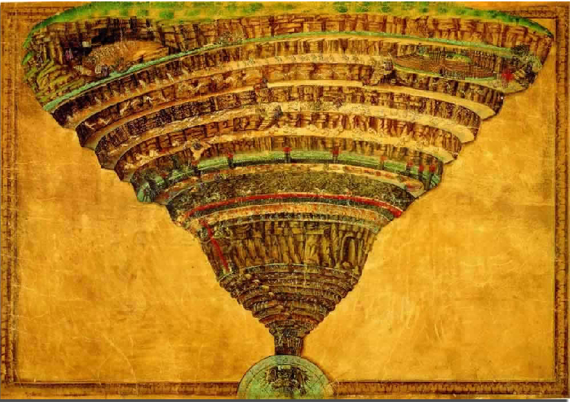

# The PHP Inferno

## A set of guided exercises through PHP Hell

The PHP inferno is a cautionary tale about the features of PHP and how to use them safely. You will learn of the sins of the language and how to remain pious even in the darkest PHP codebases.

### Limbo

The beginning of your trip introduces you to basic PHP.

### Lust

Arrays are PHP's most sensuous sinners.

### Gluttony

Strings consume content, regular expressions take all they can.

### Greed

Classes want everything for themselves.

### Anger

Callables in PHP can drive you into a rage.

### Heresy

Type Juggling spits in the face of strong types.

### Violence

Exceptions and errors in PHP brutally alter programs.

### Fraud

PHP's INI file is filled with contradictions. Who are you PHP?

### Treachery

The worst sins in the language, reserved for the lowest level of Hell.